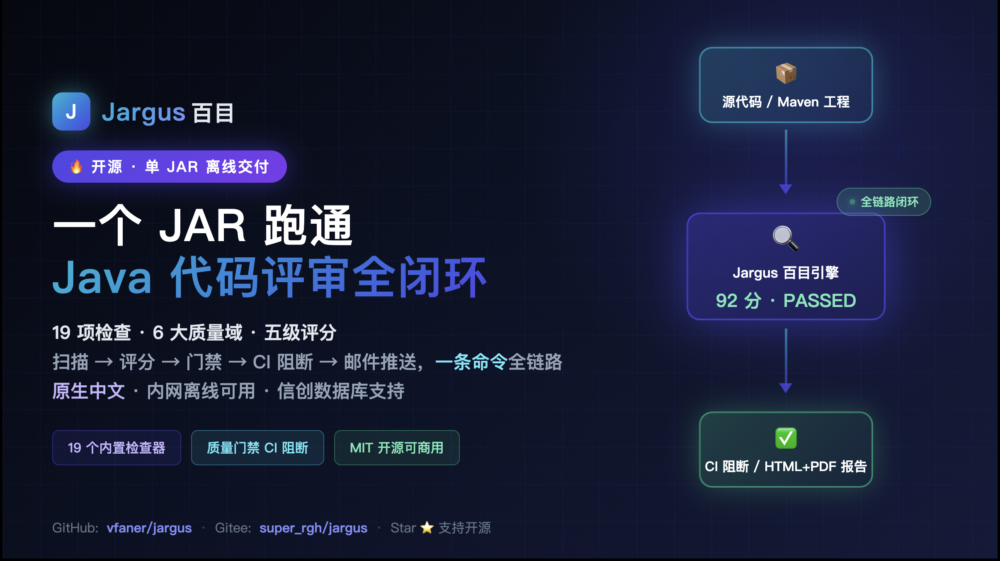
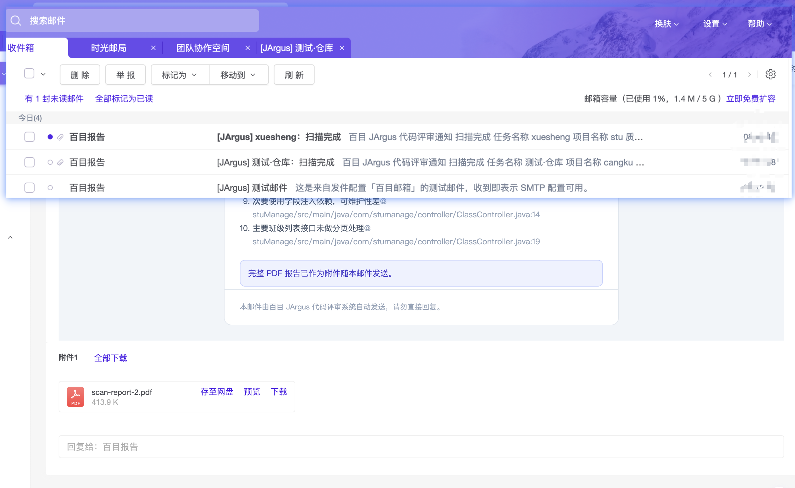

# JArgus · Java Code Review Platform

[中文](README.md) | [English](README_EN.md) | [Website jargus.qqmu.com](https://jargus.qqmu.com/)

> An out-of-the-box Java code quality review platform: local static analysis engine + optional AI deep review + SonarQube-style five-grade scoring & quality gates + end-to-end CI/CD wiring + email report delivery.
> Shipped as a single JAR / single Docker image with an embedded database — zero external dependencies, fully offline capable, with native Chinese UI, rules and reports.



> 🎬 **Deployment walkthrough**: [~21-minute full deployment demo on Bilibili](https://www.bilibili.com/video/BV1aMav6iEgd/) (Chinese narration) — from download & startup to the first finished review.

## 📖 Background

- **High entry barrier of enterprise platforms**: full-featured code quality platforms typically require dedicated servers, databases and operational effort, making trials and small-team adoption costly;
- **Gap between scanning and governance**: a good share of static analysis tools stop at outputting issue lists, with no scoring, gates, visual reports or follow-up governance loop;
- **AI not integrated with static analysis**: coding assistants each run their own models, which are hard to manage centrally and are not combined with static analysis results;
- **Extra requirements in Chinese enterprises**: air-gapped intranets, domestic (Xinchuang) databases, domestic LLMs, Chinese reporting materials.

JArgus therefore ships **one JAR / one container** delivering the full loop "scan → score → gate → report → CI blocking → email delivery": embedded H2 out of the box, 19 checkers, optional LLM integration, fully Chinese-native.

## ✨ Core Features

- **Multiple ingestion methods**: ZIP upload, code paste, automatic Git clone in CI (GitHub / GitLab / Gitee / self-hosted platforms, private-repo credentials supported); code snapshots are retained so every issue traces back to source context with line numbers and highlighted problem lines.
- **Local static analysis**: fully offline; 19 checkers covering six quality domains — bugs (null pointers / resource leaks / exception handling), security (SQL injection / command injection / deserialization / hardcoded secrets / XXE / SSRF, etc.), architecture layering, concurrency, style & redundancy (incl. CPD-style duplicate code), dependency CVE vulnerabilities.
- **AI deep review (optional)**: OpenAI-compatible / Anthropic dual protocols with 12 built-in vendor templates (Bailian / Ark / DeepSeek / Kimi / Zhipu / Qianfan / Gemini / Claude / Ollama, etc.), API keys AES-encrypted; per-issue "AI enhanced suggestion" (analysis / fix plan / fix code), batch deep review with live progress.
- **Five-grade scoring & quality gate**: BLOCKER / CRITICAL / MAJOR / MINOR / INFO; per-grade deductions, pass threshold and grade bands are customizable in the UI and take effect on save; technical debt estimation included.
- **Issue governance**: same-file same-rule issues auto-merged; line-level / rule-level ignores with recorded reasons; checker toggles and rule thresholds configurable in the UI.
- **Reports & email delivery**: one-click HTML / PDF Chinese report export (CJK fonts embedded); multiple SMTP sender configs (SSL / STARTTLS, test mail, AES-encrypted credentials) plus recipient management; tick "Email notification" on a scan or CI trigger and the finished report (**HTML summary body + PDF attachment**) is mailed automatically — failures are notified too, and delivery status shows up in scan history.
- **CI/CD integration**: webhook-triggered scans (HMAC signatures verified per platform convention); commit status and MR/PR comment write-back on completion so pipelines block merges on the gate verdict; see the guide below.
- **Auth & security**: JWT local accounts + optional OAuth2 SSO, admin / read-only roles; database passwords, API keys, repo tokens and SMTP credentials all AES-encrypted at rest; fully parameterized SQL, Zip Slip protection on archive extraction.
- **UI & i18n**: Thymeleaf server-side rendering, no Vue / npm build chain, zero CDN; Chinese / English, dark / light themes, responsive layout.
- **Multi-database**: embedded H2 by default with zero installation; also supports 18 database types — MySQL / PostgreSQL / Oracle / SQL Server / DM / Kingbase / openGauss / OceanBase, etc. — with drivers bundled, visual switching in the UI and automatic schema creation & migration.

## 🧰 Tech Stack

| Layer | Choices |
|-------|---------|
| Backend | Spring Boot 3.2.5 · Java 17 · MyBatis-Plus 3.5.5 · embedded H2 + 17 bundled drivers · dynamic multi-datasource |
| Static analysis | JavaParser 3.25 (AST + symbol solving) · ASM 9.6 · custom CPD-style duplicate-code fingerprinting |
| AI integration | OpenAI-compatible / Anthropic dual-protocol adapter |
| Reports & email | OpenPDF (vector CJK PDF) · Thymeleaf HTML reports · Spring Mail |
| Security | JWT · BCrypt · AES config encryption · OAuth2 remote auth |
| Frontend | Thymeleaf SSR · vanilla JavaScript · zero CDN |
| Deployment | Single JAR · multi-stage Docker (CJK fonts baked in, non-root, HEALTHCHECK) |

## 🖼️ Screenshots

All screenshots are taken from real running pages; image assets live in the [`images/`](images) directory.

<table>
  <tr>
    <td width="33%" align="center"><br><sub>Dashboard</sub></td>
    <td width="33%" align="center"><br><sub>Dark theme</sub></td>
    <td width="33%" align="center"><br><sub>English UI</sub></td>
  </tr>
  <tr>
    <td width="33%" align="center"><br><sub>New scan</sub></td>
    <td width="33%" align="center"><br><sub>Scan history</sub></td>
    <td width="33%" align="center"><br><sub>Scan result</sub></td>
  </tr>
  <tr>
    <td width="33%" align="center"><br><sub>Issue detail & AI suggestion</sub></td>
    <td width="33%" align="center"><br><sub>Exported report</sub></td>
    <td width="33%" align="center"><br><sub>Checker settings</sub></td>
  </tr>
  <tr>
    <td width="33%" align="center"><br><sub>Review rules</sub></td>
    <td width="33%" align="center"><br><sub>Ignore rules</sub></td>
    <td width="33%" align="center"><br><sub>Quality gate</sub></td>
  </tr>
  <tr>
    <td width="33%" align="center"><br><sub>SMTP senders</sub></td>
    <td width="33%" align="center"><br><sub>Mail recipients</sub></td>
    <td width="33%" align="center"><br><sub>Report email delivered</sub></td>
  </tr>
  <tr>
    <td width="33%" align="center"><br><sub>CI/CD triggers</sub></td>
    <td width="33%" align="center"><br><sub>New trigger</sub></td>
    <td width="33%" align="center"><br><sub>Trigger scan records</sub></td>
  </tr>
  <tr>
    <td width="33%" align="center"><br><sub>Database settings</sub></td>
    <td width="33%" align="center"><br><sub>Remote auth</sub></td>
    <td width="33%" align="center"><br><sub>New remote auth</sub></td>
  </tr>
  <tr>
    <td width="33%" align="center"><br><sub>AI provider settings</sub></td>
    <td width="33%" align="center"><br><sub>System info</sub></td>
    <td width="33%"></td>
  </tr>
</table>

## 📊 Feature Comparison

| Dimension | **JArgus** | SonarQube (Community) | PMD / SpotBugs / Checkstyle | CodeQL |
|-----------|------------|-----------------------|------------------------------|--------|
| Deployment | Single JAR / container, embedded DB | Separate server / database / compute engine | CLI / IDE plugins only | Dedicated CLI, hosted on GitHub |
| Chinese | Native UI / rules / reports | English-first | English | English |
| AI review | Multi-vendor LLMs + per-issue fix suggestions | Not in Community | Not included | Not included |
| Scoring & gate | Five-grade scoring; deductions / thresholds customizable in UI, instant effect | Has scoring config; rating model officially defined | Issue lists only | No built-in scoring |
| Duplicate code | CPD-style fingerprints, boilerplate excluded | Built-in CPD (cross-project paid) | CPD ships with PMD | None |
| Dependency CVEs | Built-in advisory store + optional OSV enrichment | Needs plugin / paid | None | None |
| Architecture rules | Built-in | Paid rule engine | Not included | Hand-written QL required |
| CI/CD | Webhook + status write-back + MR/PR comments | Needs plugins | DIY scripts | GitHub ecosystem only |
| Report email | Auto HTML summary + PDF attachment | Custom integration required | Not included | Not included |
| Domestic (Xinchuang) DBs | DM / Kingbase / openGauss etc. drivers bundled | Mainstream databases only | N/A | N/A |
| Licensing | MIT | Community free, enterprise paid | Free | Private repos require paid GHAS |
| Language coverage | Java | Multi-language | Mostly Java | Multi-language |

> Compiled from each product's official public documentation as of September 2026, for selection reference only; it does not constitute an evaluation or endorsement of any product. Corrections are welcome via Issue / PR.

**Where each fits**: for polyglot repositories and long-term trend governance, SonarQube / CodeQL cover more ground; JArgus — single-JAR deployment, native Chinese, optional AI, Java-only focus — suits small/medium Java teams, air-gapped intranets, Xinchuang projects and teaching demos.

## 🚀 Deployment

### Requirements

| Method | Requires |
|--------|----------|
| Release JAR | JDK / JRE 17+ |
| Build from source | JDK 17+ · Maven 3.9+ |
| Docker | Docker 20.10+ / Docker Compose v2 |

### Option 1: Release JAR (no source needed, fastest)

Download the **runnable Jar** straight from a Release (the very same artifact on GitHub and Gitee, ~86MB, 17 bundled database drivers):

- GitHub Releases: <https://github.com/vfaner/jargus/releases>
- Gitee Releases: <https://gitee.com/super_rgh/jargus/releases>

```bash
java -jar jargus.jar
```

> Release artifacts now use the fixed name `jargus.jar` (no version suffix): download, run with `java -jar jargus.jar`, and upgrade later in-place via the **Update now** button on the System page (downloads, swaps the JAR and restarts automatically). Older release artifacts still carry the version suffix.

- First run auto-initializes the embedded H2 database (`data/`), scan snapshots & reports (`work/`) and logs (`logs/`) in the working directory — no external database required;
- Open <http://localhost:8080>, default account `admin / 123456` (change the password after first login);
- Custom port: `java -jar jargus.jar --server.port=9090`;
- Login state is a 24-hour cookie (tunable via `app.jwt-expire-hours`). The JWT signing secret is **generated randomly per startup when unset**: every restart/redeploy requires signing in again, and there is no public default secret to forge. Set `--app.jwt-secret=<secret>` only when logins must survive restarts (e.g. long-lived Bearer scripts);
- Override the AES key in production: `--app.crypto-key=<new-aes-key>` (at-rest encryption of passwords and other sensitive fields).

### Option 2: Build from Source

```bash
git clone https://gitee.com/super_rgh/jargus.git   # or github.com/vfaner/jargus
cd jargus
mvn package -DskipTests

# Run (data/ database and work/ snapshots & reports are created in the working directory)
java -jar target/jargus.jar
```

Development mode: `mvn spring-boot:run` (template caching disabled — just refresh).

Default accounts (created on first start — **change the passwords immediately**):

| Account | Password | Role |
|---------|----------|------|
| admin | 123456 | Administrator (full access) |
| view | 123456 | Read-only |

### Option 3: Docker (recommended for production)

**docker compose:**

```bash
# Optional: copy .env.example to .env and change the JWT & AES secrets
docker compose up -d --build

docker compose ps          # status
docker compose logs -f     # logs
```

**Plain docker:**

```bash
# Build the image (multi-stage: Maven build → JRE runtime)
./scripts/docker-build.sh 2.0.3
# In mainland-China networks, build via registry mirrors:
./scripts/docker-build-cn.sh 2.0.3

# Run with persistent volumes
docker run -d --name jargus \
  -p 8080:8080 \
  -v jargus-data:/app/data \
  -v jargus-work:/app/work \
  -v jargus-logs:/app/logs \
  -v jargus-lib:/app/lib \
  -e APP_CRYPTO_KEY="your-16-char-key" \
  --restart unless-stopped \
  jargus:2.0.3
```

Health check: `curl http://localhost:8080/actuator/health` → `{"status":"UP"}`

**Image highlights**: Noto CJK / WenQuanYi fonts baked in (PDF reports render Chinese correctly), non-root user, built-in HEALTHCHECK, graceful shutdown.

**Key environment variables:**

| Variable | Default | Description |
|----------|---------|-------------|
| `SPRING_PROFILES_ACTIVE` | `prod` | Production profile |
| `APP_AUTH_ENABLED` | `true` | Enable login authentication |
| `APP_JWT_SECRET` | empty (random per startup) | JWT signing secret; empty = random per startup so restarts require re-login (recommended) — set only when logins must survive restarts |
| `APP_JWT_EXPIRE_HOURS` | `24` | Token lifetime (hours) |
| `APP_CRYPTO_KEY` | built-in placeholder | AES key for sensitive config (16 chars) — **must change in production** |
| `APP_WORK_DIR` | `/app/work` | Snapshot / report working directory |
| `APP_DRIVER_DIR` | `/app/lib/custom` | Custom JDBC driver directory |
| `DATASOURCE_URL` | container H2 file DB | Override to use an external MySQL / PostgreSQL etc. |
| `TZ` | `Asia/Shanghai` | Timezone |

Persistent paths: `/app/data` (database), `/app/work` (snapshots / reports), `/app/logs` (logs), `/app/lib` (driver JARs).

### Quick Start

1. Log in, open **New Scan**, upload a project ZIP or paste code (`samples/SampleBadCode.java` works for a quick trial);
2. When the scan finishes you land on the result page: score ring, five-grade distribution, gate verdict, every issue expandable with code context; export **HTML / PDF** reports in one click;
3. The **Quality Gate** page shows score trends and gate results; admins can click **Customize** to tune per-grade weights and thresholds;
4. Optional: connect an LLM under **AI Settings** for deep review; configure an SMTP sender and recipients under **Email** and tick "Email notification" on a scan to have reports mailed automatically;
5. CI: create a trigger and token on the **CI/CD** page — a single webhook push from your pipeline triggers the scan and writes back statuses and comments; see the detailed guide below.

## 🔌 CI/CD Integration Guide

No source changes, no plugins: create one trigger and push / MR events automatically kick off scans; when a scan finishes, the commit status and an MR/PR comment are written back according to the quality-gate verdict, so pipelines can block merges. Works with GitHub Actions, GitLab CI, Gitee Go and any generic CI.

### Step 1 — Create a trigger, get the Webhook URL and secret

**CI/CD** page → **Triggers** tab → **New Trigger**:

| Field | What to fill in |
|-------|-----------------|
| Name | Anything recognizable, e.g. "core-service main-branch scan" |
| Platform | GitHub Actions / GitLab CI / Gitee Go / Generic — decides event parsing and the write-back API |
| Platform URL | Prefilled with the official cloud; change it to your self-hosted address for enterprise editions (e.g. `https://gitlab.company.com`) |
| Branch filter | Comma-separated glob patterns, e.g. `develop,release/**`; empty = all branches; events from other branches are skipped without scanning |
| Repo scope (optional) | `owner/repo` (GitLab subgroups `group/project` work too); when set, only events from that repo are accepted, so other repos cannot misfire the same Webhook URL; empty = unrestricted |
| Repo account / token | HTTPS clone credentials for **private repos** only (GitHub: account `x-access-token` + PAT; GitLab: `oauth2` + PAT); **leave empty for public repos**; tokens are AES-encrypted at rest, leaving the field blank on edit keeps the stored value |
| Skip unit tests / Include test code / Enable AI review / Comment on MR/PR | Scan-behaviour toggles: AI review consumes model quota, commenting writes back to the platform — enable as needed |
| Enable email / Notify recipients | When on, every triggered scan mails the finished report (HTML summary + PDF attachment) to the selected recipients; requires one enabled SMTP sender and a recipient list under **Email** first |

The success dialog shows the trigger's **Webhook URL** and **Webhook secret**: **the secret is displayed in full only once** (stored encrypted), copy it now; otherwise use **Reset secret** on the trigger row later (update the platform-side config after resetting).

### Step 2 — Wire up the code platform (pick one)

**Option A: platform-side Webhook (recommended — fires automatically on push / MR)**

| Platform | Where to configure |
|----------|--------------------|
| GitHub | Repo `Settings → Webhooks → Add webhook`: Payload URL = Webhook URL, Content type = `application/json`, Secret = Webhook secret, enable `Pushes` and `Pull requests` |
| GitLab | Project `Settings → Webhooks`: URL = Webhook URL, Secret token = Webhook secret, enable Push / Merge request events |
| Gitee | Repo `Manage → WebHooks → Add webhook`: URL = Webhook URL, password = Webhook secret |

GitHub signs deliveries with `X-Hub-Signature-256` (HMAC-SHA256), GitLab sends `X-Gitlab-Token`, Gitee sends `X-Gitee-Token`; each is verified automatically and mismatched requests are rejected with 401.

**Option B: call from your CI script (any pipeline, including self-hosted runners)**

Post the JSON event (GitHub-style signature shown):

```bash
BODY='{"ref":"refs/heads/master","head_commit":{"id":"<commit-sha>"},"repository":{"clone_url":"https://github.com/owner/repo.git"}}'
SIG=$(printf '%s' "$BODY" | openssl dgst -sha256 -hmac "<webhook-secret>" -hex | awk '{print $2}')
curl -X POST "<webhook-url>?platform=GITHUB" \
  -H "Content-Type: application/json" \
  -H "X-GitHub-Event: push" \
  -H "X-Hub-Signature-256: sha256=$SIG" \
  --data-binary "$BODY"
```

Or skip the Git clone entirely and upload a source ZIP (when the pipeline already has artifacts, or the runner cannot reach the Git host):

```bash
curl -X POST "<webhook-url>/upload" \
  -H "Authorization: Bearer <webhook-secret-or-access-token>" \
  -F "file=@source.zip" -F "branch=master" -F "commitId=<commit-sha>"
```

`Authorization: Bearer` accepts either the Webhook secret or a system access token created on the **Access tokens** tab (the `X-Ci-Token` header works as well); access tokens support expiry and per-token revocation, which suits sharing across pipelines.

### Step 3 — Scan records and result write-back

1. Incoming events are verified in order — signature → repo scope → branch filter; only then is a scan record created and the repo **cloned asynchronously** (private repos use the stored credentials, each record gets an isolated work directory), zipped and scanned exactly like a UI-initiated scan;
2. The **Scan records** tab shows every trigger run (PENDING → RUNNING → SUCCESS / FAILED), filterable by trigger, with a link through to the full result page;
3. On completion a **commit status** is posted to the commit: state follows the quality-gate verdict (success / failure, description carries the score and five-grade counts), error when the scan itself fails; combine with branch protection "status checks must pass" to block merges that fail the gate;
4. With **Comment on MR/PR** enabled and an MR/PR number in the event, a comment is posted carrying the score, gate verdict, five-grade counts, tech debt and a top-issue list, linking the full report (link base comes from `app.webhook-base-url`);
5. Triggers with **Enable email** on also mail the report to the selected recipients once the scan finishes; delivery status is visible on the **Scan History** page.

> Note: Option A requires the Webhook URL to be reachable from the code platform (public mapping or a tunnel for intranet deployments); Option B's ZIP upload only needs the runner to reach this service, so it also works in fully air-gapped networks.

## 🤝 Feedback

Issues / Pull Requests welcome; QQ: 817094 / 2912167928; QQ group: 426669837; WeChat: qqmu66.

## 📄 License

Released under the [MIT License](LICENSE) — free to use, modify and distribute commercially.
